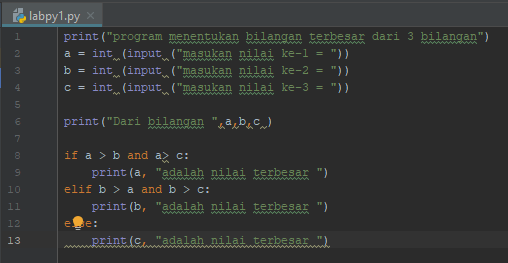

# urain algoritma
diketahui 3 buah bilangan bil1,bil2,bil3,akan dicari nilai yang terbesar.

-mulai
-tulisan inisial bil1,bil2,bil3 sebagai integer.
-tulisan inisial bil1.
-tulisan inisial bil2.
-tulisan inisial bil3.
-jika bil1> bil2 dan bil1 > bil3 maka kerjakan langkah 9,selain itu
-jika bil2> bil2 dan bil2 > bil3 maka kerjakan langkah 11,selain itu kerjakan langhkah 13.
-cetak "bilangan terbesar bilangan pertama".
-cetak "bilangan terbesar bilangan kedua".
-cetak "bilangan terbesar bilangan ketiga".
-selesai 

flowchart
# 

pernyataan if
pada phyton di kenal penggunaan struktur kondisi menggunakan statment if,dimana format/syntax penggunaan statment if adalah:
syntax:
if kondisi:
		statment_true
contoh program input 3 biangan mencari"bilangan terbesar menggunakan statment "if"
#  <h2>
